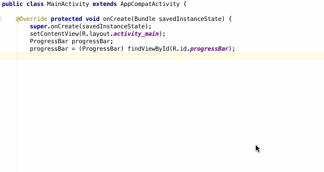

constructProcessing  
====

Writable Constract HTTP client for Android.   
## Description
Normal network processing is used try catch sentence.
But it is difficult to understand and complex.  
constructProcessing is construct network processing.  
2 pattern attribute.onSuccess is network process is success.onError is failure;
## Demo

## How to use
```java
ProgressBar progressBar;  
progressBar = (ProgressBar) findViewById(R.id.progressBar);  

CPHttp cpHttp = new CPHttp();  
cpHttp.get("http://whispon.com", new OnResult() {  
    @Override  
        public void onSuccess(String response) {  
            Log.d("success", "onSuccess");  
        }  
    @Override  
        public void onFailure(NetworkException exception) {  
            Toast.makeText(MainActivity.this, exception.toString(), Toast.LENGTH_SHORT).show();  
        }  
},progressBar);  
```
## Licence
[]  
(https://www.apache.org/licenses/LICENSE-2.0)  

## Author

[Ooshita](https://github.com/Ooshita)
